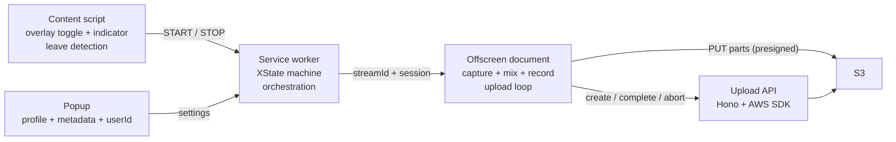

# filadd-chrome-recorder — Specification

## 1. Purpose

A generic Chrome extension to record Google Meet conversations and deliver them to S3 reliably. It replaces the previous single-purpose pipeline (`lowcode-orientation-transcriptor-extension` → transcriptions API) with a design that is:

- **Simpler for the user**: no screen-share picker, no pinned recording tab. The user starts recording from the extension popup; it stops automatically when they leave the call. An informative pill (above the join button pre-call, next to the avatar in the in-call top bar) shows what's happening and points to the extension icon.
- **More resilient**: the recording is streamed to S3 in parts *during* the call. If anything crashes mid-call, everything uploaded so far is recoverable; the old design lost the entire recording unless the final single-shot POST succeeded.
- **Flexible**: built-in *profiles* adapt the same extension to different use cases — which S3 bucket recordings land in, how objects are named, and what metadata the user must provide.

## 2. Use cases / profiles

A **profile** describes where a recording goes and what identifies it. Profiles are built into the extension; the user selects the active one in the popup.

| Profile | Purpose | Key template | Auto-resolved | User-provided |
|---|---|---|---|---|
| `orientation` | Orientation sessions; downstream pipeline matches the Meet slug to a session and transcribes | `orientation/{meetSlug}/{timestamp}.webm` | meetSlug, timestamp | — (requires a Meet call tab) |
| `private` | Personal recordings | `private/{userId}/{date}/{timestamp}.webm` | userId, date, timestamp | title (optional) |
| `project` | Recordings tied to a project | `projects/{projectId}/{userId}/{timestamp}.webm` | userId, timestamp | projectId (required) |

Profile schema (see `src/profiles/types.ts`):

- `bucket` is a **logical ref** (`orientation` | `private` | `project`) — the API maps it to a real bucket via env vars. The client can never name a bucket.
- `keyTemplate` placeholders reference auto fields (`{meetSlug}`, `{date}`, `{timestamp}`, `{userId}`, `{uuid}`) or user field keys (`{projectId}`).
- `fields` drive a dynamic form in the popup; recording can't start until required fields are filled.
- `attachAsObjectMetadata` — resolved values are also written as `x-amz-meta-*` on the object.
- `userId` is a free-form identifier the user sets once in the popup (e.g. their email).

**Trust boundary**: the extension sends raw values (`{profileId, auto, fields}`); the **API renders the object key** from its own copy of the profile table, sanitizing every segment (allowlist `[a-zA-Z0-9_\-.]`, no `..`, no leading `/`). A tampered client cannot escape its prefix or choose a bucket.

## 3. Architecture



### Context responsibilities

- **Service worker** (`src/background/service-worker.ts`): hosts the XState actor, handles invocation surfaces (action click, keyboard command), calls `tabCapture.getMediaStreamId`, manages the offscreen document lifecycle, watches `tabs.onRemoved`/`onUpdated` as the auto-stop backstop, and runs crash recovery on startup. Holds **no media handles** and does **no uploads**.
- **Offscreen document** (`src/offscreen/`): the only context allowed to hold MediaStreams long-term. Captures tab audio + mic, mixes, records, buffers, and uploads parts. Created with reason `USER_MEDIA` (no lifetime cap while active); explicitly closed after finalization.
- **Content script** (`src/content/`): detects Meet call pages, injects the Shadow-DOM overlay (toggle, recording indicator, coachmark), detects call end.
- **Popup** (`src/popup/`): profile picker, dynamic metadata form, userId setting, status mirror, recovery affordances.
- **Permission page** (`src/permission/`): a visible page whose only job is the one-time mic `getUserMedia` grant — offscreen documents cannot show permission prompts.

### State

- The recording lifecycle is an XState v5 machine: `idle → arming → recording → stopping → finalizing → finished`, plus `needsPermission` and `error`. The actor's persisted snapshot is written to `chrome.storage.session` on every transition and rehydrated when the SW restarts (MV3 SWs die after ~30 s idle — this is routine, not exceptional).
- A small **UI snapshot** (`{state, slug, profileId, startedAt, partsDone, error}`) is written to `chrome.storage.local`; the overlay and popup subscribe via `chrome.storage.onChanged`. No polling, and the UI keeps working while the SW sleeps.
- Non-serializable handles (streams, recorder, AudioContext) exist only in the offscreen document. If the SW rehydrates into `recording`, it pings the offscreen doc; no answer ⇒ transition to `error` and run upload recovery.

## 4. Research findings (drive the design — verified June 2026)

### 4.1 tabCapture invocation rules

`chrome.tabCapture.getMediaStreamId` requires **two distinct gates** ([docs](https://developer.chrome.com/docs/extensions/reference/api/tabCapture), [activeTab concept](https://developer.chrome.com/docs/extensions/develop/concepts/activeTab)):

1. **activeTab-style invocation on the target tab** — granted ONLY by: toolbar-icon click, `commands` keyboard shortcut, context-menu item, or omnibox. **Content-script clicks never grant it. Host permissions do not remove it. `chrome.action.openPopup()` does not count.** The grant persists while the user stays on the tab/origin.
2. **A transient user gesture** at call time — a content-script click *does* satisfy this; the call must happen synchronously in the gesture's message handler.

**Resulting UX**: recording starts from the popup — opening it (icon click or the `_execute_action` Ctrl+Shift+S shortcut) is the invocation, and the Start button click is the gesture, so `getMediaStreamId` always succeeds from there. The on-page pill is purely informative: while idle it points the user to the extension icon, then mirrors recording/uploading/finished/error. While a session is active the popup collapses to status + Stop.

### 4.2 Leave-call detection (locale-independent, layered)

The old extension matched localized `aria-label` strings ("Leave call" in 3 languages) — fragile, and it missed non-click exits (host ends call, kicked, network drop). The new strategy stops on the first of:

1. **Primary — DOM heartbeat**: Meet renders toolbar icons as Material ligatures whose *text content* (`call_end`) is locale-independent. The content script treats the presence of the `call_end` icon as an "in call" heartbeat; its debounced disappearance (~1.5 s, tolerating re-renders) means the call ended — by any path.
2. **Media-level**: the captured tab audio track fires `ended` when capture stops (tab closed/navigated) — observed in the offscreen document, fully DOM-independent.
3. **Backstop**: `tabs.onRemoved` / `onUpdated` (URL no longer a Meet slug) in the SW.
4. **Fast path**: a click listener on the `call_end` button stops instantly, ahead of the debounce.

There is no official API for this: the Meet Add-ons SDK is an embedded-iframe product, not an extension surface.

### 4.3 Audio pipeline

Canonical graph (verified against Chrome docs/samples):

```
tabSource ─ tabGain ──→ destNode (recording) ──→ MediaRecorder
tabSource ────────────→ ctx.destination (speakers — REQUIRED, capture mutes the tab)
micSource ─ micGain ──→ destNode (recording)     mic NEVER to speakers (feedback)
```

- Tab stream: `getUserMedia({ audio: { mandatory: { chromeMediaSource: "tab", chromeMediaSourceId } } })` — a streamId from the SW is consumable in the offscreen doc since Chrome 116.
- Mic: `echoCancellation: true` (Chrome default; cancels remote audio leaking into the mic; forces mono — fine for voice).
- `AudioContext` may start `suspended` in an offscreen doc → always `await ctx.resume()`.
- Recorder: `audio/webm;codecs=opus` (guarded by `isTypeSupported`), `audioBitsPerSecond: 64000` (~28 MB/h), ~3 s timeslice.
- **Meet's mute is mirrored, not inherited**: the extension's mic capture is an independent `getUserMedia` track — Meet mutes by disabling *its own* track, so muting in Meet doesn't naturally affect the recording (and capturing "the mic as sent to the tab" is impossible: tabCapture carries tab *playback* only, and no API taps another page's outbound WebRTC audio). The content script watches the mic button's locale-independent `data-is-muted` attribute and the offscreen doc ramps `micGain` to 0/1 accordingly; the initial state is queried when capture starts.
- Known limitation: live MediaRecorder webm lacks duration/cues metadata → the final object is valid and playable but not seekable until remuxed (`ffmpeg -c copy`). Server-side concern, out of scope for v1.

### 4.4 Streaming multipart upload

Verified against AWS docs ([limits](https://docs.aws.amazon.com/AmazonS3/latest/userguide/qfacts.html), [overview](https://docs.aws.amazon.com/AmazonS3/latest/userguide/mpuoverview.html)):

- `CompleteMultipartUpload` is **pure byte concatenation** in part-number order. Splitting the MediaRecorder webm byte stream at arbitrary boundaries is valid; parts need not be independently playable; the final object is byte-identical to the original stream.
- Parts: 5 MiB–5 GiB each (last part any size), max 10,000. **Part numbers must be consecutive from 1** — a hard failure with SDK checksums active, and AWS SDK v3 enables CRC checksums by default. The API's S3Client therefore sets `requestChecksumCalculation: "WHEN_REQUIRED"` to keep presigned part PUTs signature-clean.
- Multipart sessions never expire and incomplete uploads bill storage → each bucket needs a lifecycle rule `AbortIncompleteMultipartUpload: { DaysAfterInitiation: 7 }`.
- **Bucket CORS must list `ETag` in `ExposeHeaders`** or `response.headers.get("ETag")` silently returns `null` (the classic browser-multipart failure). See §7.
- `ListParts` can rebuild `{PartNumber, ETag}` after a crash, but AWS recommends maintaining your own ETag ledger and using ListParts only for verification — we do both.
- Uploads run in the **offscreen document**: MV3 service workers are killed on >30 s fetches / >5 min requests; a `USER_MEDIA` offscreen doc has no such caps.

### 4.5 Persistence: metadata only, no audio in IndexedDB

The offscreen document owns capture; if it dies, capture is over — there is no future audio to protect. Persisting audio bytes (the old extension's IndexedDB chunk store) would only salvage the *unflushed tail* (< one part) after a full browser crash, at the cost of doubling I/O for the entire recording.

**Decision**: audio buffers in memory; `{uploadId, key, bucketRef, profileId, parts: {partNumber → ETag}}` persists to `chrome.storage.local` after every successful part. Worst-case loss on a hard crash = the unflushed tail, bounded by flushing at the 5 MiB floor plus a time-based flush. Recovery on restart completes the uploaded prefix into a playable object. Revisit only if "never lose the last minutes across a browser crash" becomes a product requirement.

### 4.6 State machine library

XState v5: the only mature option with first-class snapshot persistence (`actor.getPersistedSnapshot()` / `createActor(machine, { snapshot })`), DOM-free core, TypeScript-first. `@xstate/fsm` is deprecated; robot3/zag-js have no persistence story. Caveats handled: actions are not re-executed on rehydrate; snapshots are invalidated by machine-shape changes → fall back to `idle` on an unreadable snapshot.

## 5. Recording flow (end to end)

1. Content script matches `meet.google.com/([a-z]{3}-[a-z]{4}-[a-z]{3})` → injects the informative pill: above the join button on the pre-join screen (`[data-promo-anchor-id="join-button"]` → `[jsname="Qx7uuf"]`), after the account avatar in the in-call top bar (geometric heuristic over `img[src*="googleusercontent.com"]`), floating top-right as fallback. While idle the pill points to the extension icon.
2. User starts from the popup (or Ctrl+Shift+S). Mic missing → SW opens the permission page; required fields unfilled → the popup form blocks the start.
3. SW: `getMediaStreamId({ targetTabId })` → creates the upload session via the API and persists the session ledger → ensures the offscreen doc → sends `START_CAPTURE { streamId, session }`.
4. Offscreen: builds the audio graph, starts MediaRecorder; chunks accumulate in memory; at ≥5 MiB a part is cut → presigned URL requested → PUT (retry w/ exponential backoff + jitter; fresh URL per attempt) → `{partNumber, etag}` reported to the SW, which persists the ledger (offscreen docs cannot touch `chrome.storage` — they only get `chrome.runtime`).
5. Stop (leave detection, tab close, track end, or popup stop button) → streams released immediately (the OS recording indicator goes away) → final part of any size flushed → `complete` → UI snapshot `finished` → offscreen doc closed.
6. Cancel → `abort` (no orphaned parts billing).
7. `runtime.onStartup`: an unfinished persisted session → verify via ListParts → complete the prefix, or surface retry/abort in the popup.

## 6. Upload API

`api/` — Node + Hono + AWS SDK v3, bearer auth (timing-safe compare, fail-closed) + origin allowlist.

| Route | Body → Response |
|---|---|
| `POST /uploads` | `{profileId, auto, fields}` → validates, renders + sanitizes key, `CreateMultipartUpload` → `{uploadId, key, bucketRef}` |
| `POST /uploads/parts` | `{bucketRef, key, uploadId, partNumbers[]}` → `{urls: [{partNumber, url}]}` (presigned `UploadPartCommand`, 1 h) |
| `POST /uploads/complete` | `{bucketRef, key, uploadId, parts: [{PartNumber, ETag}]}` → `{key, location}` |
| `POST /uploads/list-parts` | `{bucketRef, key, uploadId}` → `{parts: [{PartNumber, ETag}]}` (paginated; recovery) |
| `DELETE /uploads` | `{bucketRef, key, uploadId}` → `{aborted: true}` |

Env (see `api/.env.example`): `API_TOKEN`, `ALLOWED_ORIGINS`, `AWS_REGION`, credentials, `S3_BUCKET_ORIENTATION|PRIVATE|PROJECT`, `PRESIGN_EXPIRES_SECONDS`.

## 7. S3 bucket setup (required, per bucket)

CORS:

```json
[{
  "AllowedOrigins": ["chrome-extension://<EXTENSION_ID>"],
  "AllowedMethods": ["PUT"],
  "AllowedHeaders": ["*"],
  "ExposeHeaders": ["ETag"]
}]
```

Lifecycle rule:

```json
{ "Rules": [{ "ID": "abort-incomplete-mpu", "Status": "Enabled",
  "Filter": {}, "AbortIncompleteMultipartUpload": { "DaysAfterInitiation": 7 } }] }
```

## 8. Future work (explicitly out of scope for v1)

- Orientation completion webhook: on `complete` of an `orientation` upload, notify the existing transcriptions API (`{meet_slug, file_url}`) server-side.
- Remote/dynamic profiles fetched from the API.
- Server-side remux for seekable webm (`ffmpeg -c copy`).
- Tail persistence across browser crashes (IndexedDB) if it becomes a product requirement.
- Mic device picker.
