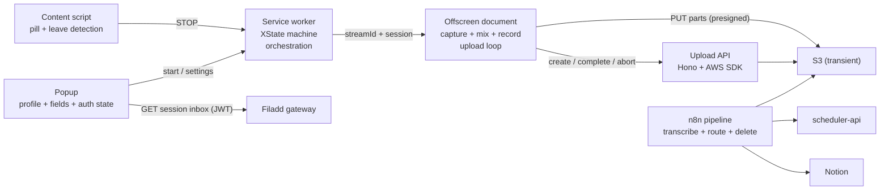
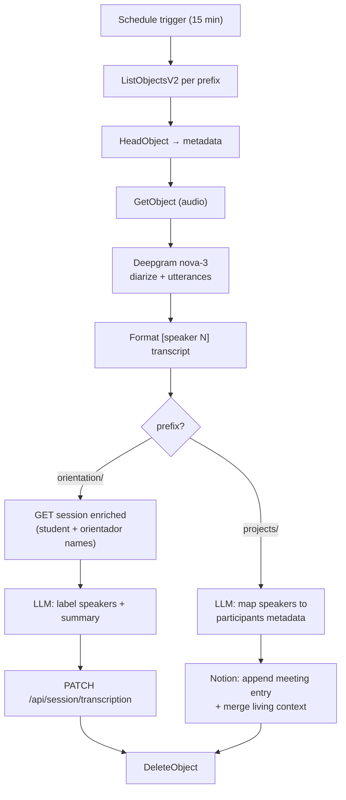

# filadd-chrome-recorder — Specification

## 1. Purpose

A Chrome extension plus processing pipeline that records Google Meet conversations and turns them into **transcriptions and derived artifacts** — the audio itself is transient. It replaces the previous single-purpose pipeline (`lowcode-orientation-transcriptor-extension` → transcriptions API → n8n slug-matching) with a design that is:

- **Simpler for the user**: no screen-share picker, no pinned recording tab. The user starts recording from the extension popup; it stops automatically when they leave the call. An informative pill (above the join button pre-call, next to the avatar in the in-call top bar) shows what's happening and points to the extension icon.
- **More resilient**: the recording is streamed to S3 in parts *during* the call. If anything crashes mid-call, everything uploaded so far is recoverable; the old design lost the entire recording unless the final single-shot POST succeeded.
- **Deterministic downstream**: each profile captures the association it needs (**session id**, **pitch id**) *at record time*, stamped as S3 object metadata. The old pipeline had to reconstruct "which orientation session is this?" after the fact via a Metabase time-window query and Calendly-redirect resolution — with a dedicated `SESSION_NOT_FOUND` failure state. That entire matching layer disappears.
- **Audio-transient by design**: S3 is a staging queue, not an archive. The pipeline deletes each object after successful processing; a lifecycle rule expires stragglers after 3 days. Only transcripts and what's derived from them persist.

## 2. Use cases / profiles

A **profile** describes what identifies a recording, where the audio stages, and what the pipeline does with it. Profiles are built into the extension; the user selects the active one in the popup. Fields are hardcoded per profile — there is no dynamic field framework.

| Profile | Purpose | Key template | Auto-resolved | User-provided | Pipeline destination |
|---|---|---|---|---|---|
| `orientation` | Orientation sessions | `orientation/{timestamp}-{sessionId}.webm` | meetSlug, timestamp, userId | `sessionId` (required — picked from a dropdown of today's sessions; manual id fallback) | Transcription + summary PATCHed onto the scheduler-api session |
| `project` | Pitch/project conversations | `projects/{timestamp}-{uuid}.webm` | meetSlug, timestamp, userId, uuid | `pitchId` (required — select over the settings-managed pitch list), `participants` (required — comma-separated names, prefilled from the previous recording of the same pitch) | Transcript + living context page under the Notion pitch |

The former `private` profile was dropped.

### Object metadata is the pipeline contract

Keys are transient and no longer encode browse structure (no per-session folders) — **`x-amz-meta-*` metadata carries everything the pipeline needs**:

| Metadata key | orientation | project | Source |
|---|---|---|---|
| `session_id` | ✓ | — | `sessionId` field |
| `pitch_id` | — | ✓ | `pitchId` field (Notion page id) |
| `participants` | — | ✓ | `participants` field |
| `meet_slug` | ✓ | ✓ | auto |
| `recorded_by` | ✓ | ✓ | auto (`userId` setting) |
| `started_at` | ✓ | ✓ | auto (`timestamp`) |

Constraints (AWS): metadata is set once at `CreateMultipartUpload` and is immutable afterwards; the total UTF-8 size of all keys+values is capped at 2 KB; values must stay US-ASCII or S3 RFC-2047-mangles them on read. The API therefore maps field names to these snake_case keys, strips non-ASCII, truncates each value to 256 chars, and enforces the 2 KB aggregate cap. Mutable per-object state (retry counts, failure markers) uses **object tags** instead — see §8.

**Trust boundary**: the extension sends raw values (`{profileId, auto, fields}`); the **API renders the object key and metadata** from its own copy of the profile table, sanitizing every key segment (allowlist `[a-zA-Z0-9_\-.]`, no `..`, no leading `/`) and validating field shapes (`sessionId` numeric, `pitchId` a 32-hex Notion page id). A tampered client cannot escape its prefix, choose a bucket, or smuggle metadata.

## 3. Architecture



### Context responsibilities

- **Service worker** (`src/background/service-worker.ts`): hosts the XState actor, handles invocation surfaces (action click, keyboard command), calls `tabCapture.getMediaStreamId`, manages the offscreen document lifecycle, watches `tabs.onRemoved`/`onUpdated` as the auto-stop backstop, and runs crash recovery on startup. Holds **no media handles** and does **no uploads**.
- **Offscreen document** (`src/offscreen/`): the only context allowed to hold MediaStreams long-term. Captures tab audio + mic, mixes, records, buffers, and uploads parts. Created with reason `USER_MEDIA` (no lifetime cap while active); explicitly closed after finalization.
- **Content script** (`src/content/`): detects Meet call pages, injects the Shadow-DOM overlay (toggle, recording indicator, coachmark), detects call end.
- **Popup** (`src/popup/`): profile picker, per-profile field form (session dropdown / pitch select + participants), Filadd auth state + login prompt, userId setting, pitch-list management in settings, status mirror, recovery affordances.
- **Permission page** (`src/permission/`): a visible page whose only job is the one-time mic `getUserMedia` grant — offscreen documents cannot show permission prompts.

### State

- The recording lifecycle is an XState v5 machine: `idle → arming → recording → stopping → finalizing → finished`, plus `needsPermission` and `error`. The actor's persisted snapshot is written to `chrome.storage.session` on every transition and rehydrated when the SW restarts (MV3 SWs die after ~30 s idle — this is routine, not exceptional).
- A small **UI snapshot** (`{state, slug, profileId, startedAt, partsDone, error}`) is written to `chrome.storage.local`; the overlay and popup subscribe via `chrome.storage.onChanged`. No polling, and the UI keeps working while the SW sleeps.
- Non-serializable handles (streams, recorder, AudioContext) exist only in the offscreen document. If the SW rehydrates into `recording`, it pings the offscreen doc; no answer ⇒ transition to `error` and run upload recovery.

## 4. Research findings (drive the design — verified June 2026)

### 4.1 tabCapture invocation rules

`chrome.tabCapture.getMediaStreamId` requires **two distinct gates** ([docs](https://developer.chrome.com/docs/extensions/reference/api/tabCapture), [activeTab concept](https://developer.chrome.com/docs/extensions/develop/concepts/activeTab)):

1. **activeTab-style invocation on the target tab** — granted ONLY by: toolbar-icon click, `commands` keyboard shortcut, context-menu item, or omnibox. **Content-script clicks never grant it. Host permissions do not remove it. `chrome.action.openPopup()` does not count.** The grant persists while the user stays on the tab/origin.
2. **A transient user gesture** at call time — a content-script click *does* satisfy this; the call must happen synchronously in the gesture's message handler.

**Resulting UX**: recording starts from the popup — opening it (icon click or the `_execute_action` Ctrl+Shift+S shortcut) is the invocation, and the Start button click is the gesture, so `getMediaStreamId` always succeeds from there. The on-page pill is purely informative: while idle it points the user to the extension icon, then mirrors recording/uploading/finished/error. While a session is active the popup collapses to status + Stop.

### 4.2 Leave-call detection (locale-independent, layered)

The old extension matched localized `aria-label` strings ("Leave call" in 3 languages) — fragile, and it missed non-click exits (host ends call, kicked, network drop). The new strategy stops on the first of:

1. **Primary — DOM heartbeat**: Meet renders toolbar icons as Material ligatures whose *text content* (`call_end`) is locale-independent. The content script treats the presence of the `call_end` icon as an "in call" heartbeat; its debounced disappearance (~1.5 s, tolerating re-renders) means the call ended — by any path.
2. **Media-level**: the captured tab audio track fires `ended` when capture stops (tab closed/navigated) — observed in the offscreen document, fully DOM-independent.
3. **Backstop**: `tabs.onRemoved` / `onUpdated` (URL no longer a Meet slug) in the SW.
4. **Fast path**: a click listener on the `call_end` button stops instantly, ahead of the debounce.

There is no official API for this: the Meet Add-ons SDK is an embedded-iframe product, not an extension surface.

### 4.3 Audio pipeline

Canonical graph (verified against Chrome docs/samples):

```
tabSource ─ tabGain ──→ destNode (recording) ──→ MediaRecorder
tabSource ────────────→ ctx.destination (speakers — REQUIRED, capture mutes the tab)
micSource ─ micGain ──→ destNode (recording)     mic NEVER to speakers (feedback)
```

- Tab stream: `getUserMedia({ audio: { mandatory: { chromeMediaSource: "tab", chromeMediaSourceId } } })` — a streamId from the SW is consumable in the offscreen doc since Chrome 116.
- Mic: `echoCancellation: true` (Chrome default; cancels remote audio leaking into the mic; forces mono — fine for voice).
- `AudioContext` may start `suspended` in an offscreen doc → always `await ctx.resume()`.
- Recorder: `audio/webm;codecs=opus` (guarded by `isTypeSupported`), `audioBitsPerSecond: 64000` (~28 MB/h), ~3 s timeslice.
- **Meet's mute is mirrored, not inherited**: the extension's mic capture is an independent `getUserMedia` track — Meet mutes by disabling *its own* track, so muting in Meet doesn't naturally affect the recording (and capturing "the mic as sent to the tab" is impossible: tabCapture carries tab *playback* only, and no API taps another page's outbound WebRTC audio). The content script watches the mic button's locale-independent `data-is-muted` attribute and the offscreen doc ramps `micGain` to 0/1 accordingly; the initial state is queried when capture starts.
- Known limitation: live MediaRecorder webm lacks duration/cues metadata → the final object is valid and playable but not seekable until remuxed (`ffmpeg -c copy`). Irrelevant once the pipeline consumes and deletes the audio.

### 4.4 Streaming multipart upload

Verified against AWS docs ([limits](https://docs.aws.amazon.com/AmazonS3/latest/userguide/qfacts.html), [overview](https://docs.aws.amazon.com/AmazonS3/latest/userguide/mpuoverview.html)):

- `CompleteMultipartUpload` is **pure byte concatenation** in part-number order. Splitting the MediaRecorder webm byte stream at arbitrary boundaries is valid; parts need not be independently playable; the final object is byte-identical to the original stream.
- Parts: 5 MiB–5 GiB each (last part any size), max 10,000. **Part numbers must be consecutive from 1** — a hard failure with SDK checksums active, and AWS SDK v3 enables CRC checksums by default. The API's S3Client therefore sets `requestChecksumCalculation: "WHEN_REQUIRED"` to keep presigned part PUTs signature-clean.
- Multipart sessions never expire and incomplete uploads bill storage → the bucket needs a lifecycle rule `AbortIncompleteMultipartUpload: { DaysAfterInitiation: 7 }`.
- **Bucket CORS must list `ETag` in `ExposeHeaders`** or `response.headers.get("ETag")` silently returns `null` (the classic browser-multipart failure). See §9.
- `ListParts` can rebuild `{PartNumber, ETag}` after a crash, but AWS recommends maintaining your own ETag ledger and using ListParts only for verification — we do both.
- Uploads run in the **offscreen document**: MV3 service workers are killed on >30 s fetches / >5 min requests; a `USER_MEDIA` offscreen doc has no such caps.
- **Object metadata must be supplied at `CreateMultipartUpload`** — not on parts, not on complete — and is immutable afterwards (changing it requires a self-copy). User-defined metadata is capped at 2 KB total and is returned by `HeadObject`/`GetObject` but **not** by `ListObjectsV2` — which is fine: the pipeline lists keys, then `HeadObject`s each one.

### 4.5 Persistence: metadata only, no audio in IndexedDB

The offscreen document owns capture; if it dies, capture is over — there is no future audio to protect. Persisting audio bytes (the old extension's IndexedDB chunk store) would only salvage the *unflushed tail* (< one part) after a full browser crash, at the cost of doubling I/O for the entire recording.

**Decision**: audio buffers in memory; `{uploadId, key, bucketRef, profileId, parts: {partNumber → ETag}}` persists to `chrome.storage.local` after every successful part. Worst-case loss on a hard crash = the unflushed tail — parts can only be cut at the 5 MiB floor (S3 rejects smaller non-final parts, so a time-based flush is impossible), which at 64 kbps means up to ~11 minutes of audio. Recovery on restart completes the uploaded prefix into a playable object. Revisit only if "never lose the last minutes across a browser crash" becomes a product requirement.

### 4.6 State machine library

XState v5: the only mature option with first-class snapshot persistence (`actor.getPersistedSnapshot()` / `createActor(machine, { snapshot })`), DOM-free core, TypeScript-first. `@xstate/fsm` is deprecated; robot3/zag-js have no persistence story. Caveats handled: actions are not re-executed on rehydrate; snapshots are invalidated by machine-shape changes → fall back to `idle` on an unreadable snapshot.

## 5. Filadd auth (session reuse — no custom login)

The extension reuses the Filadd web session instead of implementing its own login:

- **Cookie contract**: after any login on filadd.com, `auth-user` stores the JWT client-side in the cookie **`auth._token.local`** on `filadd.com` (value `"Bearer <jwt>"`, URL-encoded, `secure`, `sameSite: lax`, **not httpOnly** — set via js-cookie in `auth-user/helpers/auth/cookieManager.ts`). Both the legacy app and filadd-ui read this same cookie for their `Authorization` headers, so it's a stable contract. Token lifetime ≈ 1 year.
- **Reading it**: `chrome.cookies.get({ url: "https://filadd.com", name: "auth._token.local" })` — requires the `cookies` permission plus `https://*.filadd.com/*` host_permissions (which also covers the gateway). The JWT payload (`{user_id, exp}`) is decoded client-side for display only; authorization always happens server-side at the gateway.
- **Missing/expired cookie**: the popup shows a login prompt that opens `https://filadd.com/auth/login` in a tab. A `chrome.cookies.onChanged` listener flips the popup to logged-in the moment `auth-user` writes the cookie — no redirect plumbing, no `ALLOWED_HOSTS` changes.
- **Calling the gateway**: requests go straight from the popup/SW with the cookie value as the `Authorization` header. MV3 extension contexts bypass CORS for host-permitted origins, so the gateway's origin allowlist is irrelevant here.
- **Sessions dropdown**: `GET https://gateway.filadd.com/api/scheduler/session/inbox/?utc_start_datetime=<start>&utc_end_datetime=<end>` (route `gateway/app/conf.d/routes/scheduler-api/session.json`, permissions `scheduler_admin` / `scheduler_admin.session`). Downstream, scheduler-api resolves the JWT user's **email → CalendlyAccount** and returns that orientador's `confirmed`/`to_be_confirmed` sessions in the range, including ones they're invited to as guest, enriched with student data (`scheduler-api/app/services/legacy_session.py::get_user_inbox_sessions`). The popup renders `HH:MM · student name`, storing `session.id`.
- **Degradation**: missing cookie, 401/403 (user lacks the scheduler permission), or fetch failure → the field falls back to a plain session-id text input, so recording is never blocked by auth.

## 6. Recording flow (end to end)

1. Content script matches `meet.google.com/([a-z]{3}-[a-z]{4}-[a-z]{3})` → injects the informative pill: above the join button on the pre-join screen (`[data-promo-anchor-id="join-button"]` → `[jsname="Qx7uuf"]`), after the account avatar in the in-call top bar (geometric heuristic over `img[src*="googleusercontent.com"]`), floating top-right as fallback. While idle the pill points to the extension icon.
2. User starts from the popup (or Ctrl+Shift+S). Mic missing → SW opens the permission page; required fields unfilled (orientation: session; project: pitch + participants) → the popup form blocks the start.
3. SW: `getMediaStreamId({ targetTabId })` → creates the upload session via the API (which stamps the metadata at `CreateMultipartUpload`) and persists the session ledger → ensures the offscreen doc → sends `START_CAPTURE { streamId, session }`.
4. Offscreen: builds the audio graph, starts MediaRecorder; chunks accumulate in memory; at ≥5 MiB a part is cut → presigned URL requested → PUT (retry w/ exponential backoff + jitter; fresh URL per attempt) → `{partNumber, etag}` reported to the SW, which persists the ledger (offscreen docs cannot touch `chrome.storage` — they only get `chrome.runtime`).
5. Stop (leave detection, tab close, track end, or popup stop button) → streams released immediately (the OS recording indicator goes away) → final part of any size flushed → `complete` → UI snapshot `finished` → offscreen doc closed.
6. Cancel → `abort` (no orphaned parts billing).
7. `runtime.onStartup`: an unfinished persisted session → verify via ListParts → complete the prefix, or surface retry/abort in the popup.

## 7. Upload API

`api/` — Node + Hono + AWS SDK v3, bearer auth (timing-safe compare, fail-closed) + origin allowlist.

| Route | Body → Response |
|---|---|
| `POST /uploads` | `{profileId, auto, fields}` → validates (required fields, `sessionId` numeric, `pitchId` 32-hex), renders + sanitizes key, builds snake_case metadata, `CreateMultipartUpload` → `{uploadId, key, bucketRef}` |
| `POST /uploads/parts` | `{bucketRef, key, uploadId, partNumbers[]}` → `{urls: [{partNumber, url}]}` (presigned `UploadPartCommand`, 1 h) |
| `POST /uploads/complete` | `{bucketRef, key, uploadId, parts: [{PartNumber, ETag}]}` → `{key, location}` |
| `POST /uploads/list-parts` | `{bucketRef, key, uploadId}` → `{parts: [{PartNumber, ETag}]}` (paginated; recovery) |
| `DELETE /uploads` | `{bucketRef, key, uploadId}` → `{aborted: true}` |

Env (see `api/.env.example`): `API_TOKEN`, `ALLOWED_ORIGINS`, `AWS_REGION`, credentials, `S3_BUCKET_ORIENTATION|PROJECT` (typically both point at the **same transient bucket** — prefixes already separate the profiles), `PRESIGN_EXPIRES_SECONDS`.

## 8. Processing pipeline (n8n)

The bucket is a **queue**: an object's existence means "pending"; deletion means "done". No ledger database (the old Supabase `transcription` table is retired). One n8n workflow, scheduled every 15 minutes:



**Mechanics**

- Discovery: `ListObjectsV2` on `orientation/` and `projects/`; for each key, `HeadObject` returns the metadata contract (§2). Skip objects whose tag `attempts` ≥ 3.
- Success: outputs written → `DeleteObject`. Audio is gone minutes after processing.
- Failure: `PutObjectTagging {status: failed, attempts: n+1}` (tags are mutable; metadata is not) → retried on the next run; after 3 attempts the object stays tagged for inspection and an alert fires. The 3-day lifecycle expiration (§9) is the terminal backstop.
- Transcription: Deepgram `nova-3`, `language=multi&diarize=true&punctuate=true&utterances=true`; utterances formatted as `[speaker N] text` lines (the old workflow's formatter carries over).
- **All credentials (Deepgram, LLM, Notion, AWS) live in n8n credentials** — never inline in HTTP nodes. The old workflow's inline OpenAI/Deepgram/Supabase secrets must be rotated when it's decommissioned.

**Orientation branch**

1. `GET scheduler-api /api/session/{session_id}/` (in-cluster) → student, orientador and guest names.
2. LLM pass: relabel `[speaker N]` with the two known names (role cues: who asks vs. answers), then produce the bullet summary in the session's language (existing prompt as the base).
3. `PATCH scheduler-api /api/session/transcription/?field=id&value={session_id}` with `{transcription, transcription_summary}` — same endpoint the old workflow used; consumers downstream are untouched.

**Project branch**

1. LLM pass: map `[speaker N]` to the names in the `participants` metadata using conversational cues (people address each other, introduce themselves). A speaker below the confidence threshold keeps its generic label.
2. In Notion, anchored on `pitch_id` (Pitches DB, data source `collection://66dec714-8dee-48df-bab4-332514bc087f`):
   - Ensure a **`🎙 Meeting log`** child page exists under the pitch page (created on first recording).
   - Append a per-meeting entry: date, participants, summary, and the full labeled transcript in a toggle.
   - **Living context**: read the page's "Current context" section, have the LLM merge in the new conversation — topics discussed, decisions, open action items as checkboxes (closing ones that were resolved) — and rewrite the section. Speakers left generic are flagged here; renaming them by editing the Notion page *is* the labeling interface.

## 9. S3 bucket setup (transient staging bucket)

CORS:

```json
[{
  "AllowedOrigins": ["chrome-extension://<EXTENSION_ID>"],
  "AllowedMethods": ["PUT"],
  "AllowedHeaders": ["*"],
  "ExposeHeaders": ["ETag"]
}]
```

Lifecycle rules — abort incomplete multiparts *and* expire processed-missed audio:

```json
{ "Rules": [
  { "ID": "abort-incomplete-mpu", "Status": "Enabled",
    "Filter": {}, "AbortIncompleteMultipartUpload": { "DaysAfterInitiation": 7 } },
  { "ID": "expire-staged-audio", "Status": "Enabled",
    "Filter": {}, "Expiration": { "Days": 3 } }
] }
```

The expiration rule is what makes "we never retain audio" a property of the system rather than a promise of the pipeline.

## 10. Future work (explicitly out of scope for v1)

- Event-driven pipeline trigger (S3 → SQS/webhook → n8n) if the 15-minute polling latency ever matters.
- Remote/dynamic profiles fetched from the API.
- Tail persistence across browser crashes (IndexedDB) if it becomes a product requirement.
- Mic device picker.
- Replacing the manual session-id fallback with gateway-side validation feedback (exists / belongs to you / is today).
