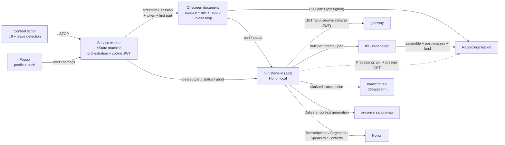

# filadd-chrome-recorder — Specification

## 1. Purpose

A Chrome extension that records Google Meet conversations and uploads them for transcription — the audio itself is transient. The design is:

- **Simpler for the user**: no screen-share picker, no pinned recording tab. The user starts recording from the extension popup; it stops automatically when they leave the call. An informative pill (above the join button pre-call, next to the avatar in the in-call top bar) shows what's happening and points to the extension icon.
- **Resilient**: the recording is streamed in parts *during* the call, so if anything crashes mid-call everything uploaded so far is recoverable.
- **Deterministic downstream**: each profile captures the association it needs (the **pitch id**) *at record time*, stamped as S3 object metadata, so the processing flow never has to reconstruct "which conversation is this?" after the fact.
- **Audio-transient by design**: the recordings bucket is a transient queue, not an archive. The processing flow deletes each object after transcription; a lifecycle rule expires stragglers. Only transcripts and what's derived from them persist.

The extension uploads through Filadd's existing **`file-uploads-api`** (multipart transfer mode); the downstream work — **diarized transcription** (`transcript-api`, Deepgram), human **speaker review** (in **Notion**), and **living-context delivery** (`ai-conversations-api`) — will ultimately be orchestrated by **n8n**. See the Notion design docs *Pitch conversations transcriber*, *Multipart Uploads*, *Transcription API*, and *Chrome Recorder Extension*.

**`api/` in this repo is a local n8n stand-in**: it now implements all three flows the real n8n will own — **Upload** (validate via the gateway, proxy the multipart upload to `file-uploads-api`), **Processing** (poll the recordings bucket → `transcript-api` diarized transcription → write the Notion Transcription + Segments + Speakers → delete the audio), and **Delivery** (poll Notion for reviewed transcripts → `ai-conversations-api` context generation → upsert the Notion Context). It is a faithful, runnable rehearsal of the n8n workflows against the real local services; **only building the actual n8n workflows remains** (see §7).

## 2. Use cases / profiles

A **profile** describes what identifies a recording and what the processing flow does with it. Profiles are built into the extension; the user selects the active one in the popup. Fields are hardcoded per profile — there is no dynamic field framework.

| Profile | Purpose | User-provided | Destination | Processing |
|---|---|---|---|---|
| `project` | Pitch/project conversations | `pitchId` (required — select over the settings-managed pitch list) | `filadd-chrome-recorder-prod` / `projects/{uuid}.webm` | Transcript + living context page under the Notion pitch (n8n) |

Speaker **names are not entered at record time** — under the new architecture they're assigned *after* transcription, **in Notion** (the reviewer sets a Person on each numeric speaker row). So `project` asks only for the pitch at record time. `project` is the only profile that ships today; the table stays a const map so another profile is a table entry, not a refactor.

### Object metadata is the processing contract

`file-uploads-api` generates the object key (`{uuid}.webm`) and lands it under the configured destination. **`x-amz-meta-*` object metadata carries what the processing flow needs**, set once at `CreateMultipartUpload` (immutable, ~2 KB total, ASCII):

| Metadata key | Source |
|---|---|
| `pitch_id` | the `pitchId` field (Notion page id) |
| `recorded_by` | the recorder's **email**, resolved from the JWT via the gateway |

**Trust boundary**: the extension sends only `{profileId, pitchId}` plus its Filadd JWT. The **stand-in renders the upload configuration** (destination bucket/path, content type, allowed mimetypes, metadata) from its own copy of the profile table, validates `pitchId` (32-hex Notion page id), and stamps `recorded_by` from the gateway-resolved email — never from the client. A tampered client cannot choose a bucket, forge `recorded_by`, or smuggle metadata.

## 3. Architecture



(Processing + Delivery run in the stand-in today; the real n8n will own them later — §7.)

### Context responsibilities

- **Service worker** (`src/background/service-worker.ts`): hosts the XState actor, handles invocation surfaces (action click, keyboard command), calls `tabCapture.getMediaStreamId`, **reads the `auth._token.local` cookie** (the offscreen doc can't), creates the upload session via the stand-in, manages the offscreen document lifecycle, watches `tabs.onRemoved`/`onUpdated` as the auto-stop backstop, and runs crash recovery on startup. Holds **no media handles** and does **no uploads**.
- **Offscreen document** (`src/offscreen/`): the only context allowed to hold MediaStreams long-term. Captures tab audio + mic, mixes, records, buffers, and runs the upload loop — PUTting parts directly to S3 and reporting ETags to the SW. Created with reason `USER_MEDIA` (no lifetime cap); explicitly closed after finalization. Receives the JWT + first presigned part from the SW in `start-capture`.
- **Content script** (`src/content/`): detects Meet call pages, injects the Shadow-DOM overlay (toggle, recording indicator, coachmark), detects call end.
- **Popup** (`src/popup/`): profile picker, per-profile field form (pitch select), userId setting, pitch-list management in settings, status mirror, and recovery affordances.
- **Permission page** (`src/permission/`): a visible page whose only job is the one-time mic `getUserMedia` grant — offscreen documents cannot show permission prompts.

Speaker review is **not** an extension surface anymore — it lives in Notion (between the stand-in's Processing and Delivery flows; §7).

### State

- The recording lifecycle is an XState v5 machine: `idle → arming → recording → stopping → finalizing → finished`, plus `needsPermission` and `error`. The actor's persisted snapshot is written to `chrome.storage.session` on every transition and rehydrated when the SW restarts (MV3 SWs die after ~30 s idle — routine).
- A small **UI snapshot** (`{state, slug, profileId, startedAt, partsDone, error}`) is written to `chrome.storage.local`; the overlay and popup subscribe via `chrome.storage.onChanged`. No polling.
- Non-serializable handles (streams, recorder, AudioContext) exist only in the offscreen document. If the SW rehydrates into `recording`, it pings the offscreen doc; no answer ⇒ transition to `error` and run upload recovery.

## 4. Research findings (drive the design — verified June 2026)

### 4.1 tabCapture invocation rules

`chrome.tabCapture.getMediaStreamId` requires **two distinct gates** ([docs](https://developer.chrome.com/docs/extensions/reference/api/tabCapture)):

1. **activeTab-style invocation on the target tab** — granted ONLY by: toolbar-icon click, `commands` keyboard shortcut, context-menu item, or omnibox. **Content-script clicks never grant it. Host permissions do not remove it.** The grant persists while the user stays on the tab/origin.
2. **A transient user gesture** at call time — a content-script click *does* satisfy this; the call must happen synchronously in the gesture's message handler.

**Resulting UX**: recording starts from the popup — opening it (icon click or the `_execute_action` Ctrl+Shift+S shortcut) is the invocation, and the Start button click is the gesture, so `getMediaStreamId` always succeeds from there.

### 4.2 Leave-call detection (locale-independent, layered)

Leave detection must be locale-independent and catch non-click exits. It stops on the first of:

1. **Primary — DOM heartbeat**: the `call_end` Material ligature's debounced disappearance (~1.5 s) means the call ended — by any path.
2. **Media-level**: the captured tab audio track fires `ended` when capture stops (tab closed/navigated) — observed in the offscreen document.
3. **Backstop**: `tabs.onRemoved` / `onUpdated` (URL no longer a Meet slug) in the SW.
4. **Fast path**: a click listener on the `call_end` button stops instantly, ahead of the debounce.

### 4.3 Audio pipeline

```
tabSource ─ tabGain ──→ destNode (recording) ──→ MediaRecorder
tabSource ────────────→ ctx.destination (speakers — REQUIRED, capture mutes the tab)
micSource ─ micGain ──→ destNode (recording)     mic NEVER to speakers (feedback)
```

- Tab stream: `getUserMedia({ audio: { mandatory: { chromeMediaSource: "tab", chromeMediaSourceId } } })`.
- Mic: `echoCancellation: true` (cancels remote audio leaking into the mic).
- `AudioContext` may start `suspended` in an offscreen doc → always `await ctx.resume()`.
- Recorder: `audio/webm;codecs=opus` (guarded by `isTypeSupported`), `audioBitsPerSecond: 64000` (~28 MB/h), ~3 s timeslice.
- **Meet's mute is mirrored, not inherited**: the content script watches the mic button's `data-is-muted` attribute and the offscreen doc ramps `micGain` to 0/1 accordingly.
- Known limitation: live MediaRecorder webm lacks duration/cues metadata → playable but not seekable until remuxed. Irrelevant once the pipeline consumes and deletes the audio. (Note: `file-uploads-api` validates the assembled file's mimetype with `python-magic`, which detects opus-in-webm as **`video/webm`** — the stand-in declares the upload as `video/webm` accordingly.)

### 4.4 Streaming multipart upload (via file-uploads-api)

- `file-uploads-api` exposes multipart as a transfer mode of its existing upload: a **create** endpoint starts the session and returns the first presigned `UploadPart` URL; a **part** endpoint records each `{key, part_number, etag}` and returns the **next** URL; the final call sets `complete: true`, after which a Celery task runs `CompleteMultipartUpload` then the standard validate → (transcode) → destination-move. **The server owns the parts ledger** (Redis) — the client stores nothing.
- `CompleteMultipartUpload` is **pure byte concatenation** in part-number order. Splitting the MediaRecorder webm at arbitrary 5 MiB boundaries is valid; the final object is byte-identical to the stream.
- Parts: 5 MiB–5 GiB each (last part any size), max 10,000, **consecutive from 1**.
- **Bucket CORS must list `ETag` in `ExposeHeaders`** or `response.headers.get("ETag")` silently returns `null` (the classic browser-multipart failure). See §8.
- **Sequential one-ahead presigning**: the create call issues the part-1 URL and each part call returns only the next URL, so parts upload in order — a single in-flight PUT that suits a streaming recorder.
- Uploads run in the **offscreen document**: MV3 service workers are killed on >30 s fetches / >5 min requests; a `USER_MEDIA` offscreen doc has no such caps.
- **Object metadata is supplied at create** (`metadata` JSON → S3 object metadata) and is immutable afterwards.

### 4.5 Persistence: metadata only, no audio in IndexedDB

The offscreen document owns capture; if it dies, capture is over — there is no future audio to protect. **Decision**: audio buffers in memory; the SW persists `{session: {key, filepath, profileId}, lastPart: {partNumber, etag}}` to `chrome.storage.local` after each part. Worst-case loss on a hard crash = the unflushed tail (< one 5 MiB part). Recovery on restart reconciles the session by `key` via `GET /uploads/:key`: complete a still-`PENDING` prefix with `complete:true` on the last recorded part, or clear a finished/vanished session.

### 4.6 State machine library

XState v5: the only mature option with first-class snapshot persistence, DOM-free core, TypeScript-first. Caveats handled: actions are not re-executed on rehydrate; snapshots invalidated by machine-shape changes → fall back to `idle` on an unreadable snapshot.

## 5. Recording flow (end to end)

1. Content script matches `meet.google.com/([a-z]{3}-[a-z]{4}-[a-z]{3})` → injects the informative pill. While idle the pill points to the extension icon.
2. User starts from the popup (or Ctrl+Shift+S). Mic missing → SW opens the permission page; `pitchId` unfilled → the popup form blocks the start; not logged into Filadd (no `auth._token.local`) → the start surfaces an auth error.
3. SW: `getMediaStreamId({ targetTabId })` → reads the JWT cookie → `POST /uploads {profileId, pitchId}` to the stand-in (which validates the user via the gateway and creates the file-uploads multipart session) → persists `{session, lastPart: null}` → ensures the offscreen doc → sends `START_CAPTURE { streamId, session, token, firstPart }`.
4. Offscreen: builds the audio graph, starts MediaRecorder; chunks accumulate in memory; at ≥5 MiB a part is cut → PUT to the held presigned URL (retry w/ backoff, reusing the URL) → read the `ETag` → report it to the SW (for the ledger) **and** to `POST /uploads/part`, which returns the next part's URL.
5. Stop (leave detection, tab close, track end, or popup stop) → streams released immediately → final part flushed and recorded with `complete:true` → poll `GET /uploads/:key` until `COMPLETED` → UI snapshot `finished` → offscreen doc closed.
6. Cancel → `DELETE /uploads/:key` (abort; no orphaned parts billing).
7. `runtime.onStartup`: an unfinished persisted session → reconcile via `GET /uploads/:key` → finalize the prefix, or surface/clear in the popup.

## 6. Upload API — the n8n stand-in (`api/`)

The extension never holds AWS credentials. The stand-in is the trust boundary and the BFF between the extension and the internal services; it mirrors what n8n's Upload flow will do.

### 6.1 Contract (what the extension calls)

All requests carry `Authorization: <auth._token.local value>` (already `Bearer <JWT>`) and `Content-Type: application/json`; CORS exposes them to the extension origin.

| Route | Body → Response |
|---|---|
| `POST /uploads` | `{profileId, pitchId}` → validate user via gateway (resolve email), validate `pitchId`, build the file-uploads config (+ metadata `{pitch_id, recorded_by}`), `createMultipart` → `{key, filepath, partNumber, url}` (first presigned part) |
| `POST /uploads/part` | `{key, partNumber, etag, complete?}` → `recordPart` → `{key, status, partNumber, url}` (next presigned part, or `ASSEMBLING` on `complete:true`) |
| `GET /uploads/:key` | → `{status, parts}` (passthrough of the file-uploads session status; recovery + completion poll) |
| `DELETE /uploads/:key` | → `204` (abort the multipart session) |

Errors: `401` (invalid/absent JWT), `400` (missing/malformed `pitchId`), `404` (unknown profile / missing session), file-uploads `409`/`422` forwarded, `502` (gateway/file-uploads unreachable).

### 6.2 Auth + proxy targets

- **Auth via the gateway**: the gateway owns JWT validation, so the stand-in forwards `Authorization` to `GET {GATEWAY_URL}/api/user/me/`. The gateway validates the token (rejects an invalid one) and injects `X-UserId`; users-api returns the user incl. `email` (= `recorded_by`). One call validates *and* resolves identity. The stand-in MUST call the gateway, not users-api directly (that would bypass validation).
- **file-uploads-api direct**: `file-uploads-api` has no app-level auth (it's gateway-fronted in prod), so the stand-in calls its multipart endpoints (`/api/presigned-multipart-upload/`, `/api/presigned-multipart-upload-part/`, `GET`/`DELETE …/{key}/`) directly at `FILE_UPLOADS_API_URL`.

### 6.3 Running it

`api/` (Node + Hono) runs locally via `npm run dev` on `:8787`. Env (`api/.env.example`): `PORT`, `ALLOWED_ORIGINS`, `GATEWAY_URL`, `FILE_UPLOADS_API_URL`, `DESTINATION_BUCKET=filadd-chrome-recorder-prod`, `DESTINATION_PATH=projects`. The gateway, users-api, and file-uploads-api run locally via the `dockerfiles` repo (`./manage.sh up file-uploads users` + the gateway). `file-uploads-api`'s S3 client points at real AWS (no MinIO override), so local part PUTs hit the real staging bucket.

## 7. Processing & delivery (implemented in the stand-in)

Transcription, speaker review, and living-context delivery are **n8n flows** in the target architecture. The stand-in (`api/`) now **rehearses them locally** so the whole pipeline can be exercised end-to-end before the real n8n exists. They are operator/schedule-triggered (no extension JWT — distinct from `/uploads`), so the stand-in exposes them as **manual endpoints** that step through each stage:

| Route | Does |
|---|---|
| `GET /processing/preview` | List bucket objects under `projects/` + their `pitch_id`/`recorded_by` metadata (read-only dry run) |
| `POST /processing/run` `{limit?}` | For each recording: presign a GET → `transcript-api` diarized transcription → create the Notion Transcription (`pending`) + Speakers + Segments → **delete the audio** |
| `POST /delivery/run` `{limit?}` | For each Transcription a reviewer marked `speakers_assigned`: rebuild the named transcript → `ai-conversations` context generation → upsert the Notion Context → mark `delivered` |

```mermaid
sequenceDiagram
    participant SI as api/ (stand-in)
    participant S3 as Recordings bucket
    participant TR as transcript-api (Deepgram)
    participant N as Notion
    participant AIC as ai-conversations-api
    Note over SI,N: Processing (POST /processing/run)
    SI->>S3: list projects/*.webm + HeadObject (pitch_id, recorded_by)
    SI->>S3: presign GET
    SI->>TR: POST /api/transcription/ {audio_url, strategy:diarized, mode:async}
    TR-->>SI: {id}; poll GET /api/transcription/{id}/ → {segments[]}
    SI->>N: create Transcription(pending) + Speakers + Segments
    SI->>S3: delete audio
    Note over N: Review (human): type each Speaker's Person, State → speakers_assigned
    Note over SI,AIC: Delivery (POST /delivery/run)
    SI->>N: query Transcriptions where State = speakers_assigned
    SI->>N: read Segments + Speakers → named transcript
    SI->>AIC: conversation (prompt) + message (current context + transcript)
    AIC-->>SI: updated context
    SI->>N: upsert Context(pitch), State → delivered
```

**Diarization is `transcript-api`, not `ai-conversations`.** `transcript-api` owns the Deepgram `diarized` strategy (`POST /api/transcription/` `strategy:diarized, mode:async`; poll `GET /api/transcription/{id}/`). `ai-conversations-api` only does the **context-generation conversation**: the stand-in sends the configured prompt as the system message and a user message with three blocks — the **pitch content** (the pitch page's title + body, as background), the **current living context**, and the **named transcript**. The prompt is a deliberately **focused "reduced situation state"** (inspired by the `evolve-situation-state` skill but stripped of its change-log/source-history/metadata cruft): it returns a short markdown living context with **Descripción / Decisiones / Action items (`- [ ]`) / Temas abiertos** sections, evolving the prior context incrementally rather than rewriting history.

### Notion data model

Four databases under the *Contexto de pitches automático* building-project page (created global + related, **not** per-page nested):

- **Recorder Transcriptions** — one row per recording: `Name`, `State` (select: `pending`/`speakers_assigned`/`delivered`/`failed`), `Pitch` (relation → the existing Pitches DB), `Recorded by` (person), and two-way `Segments`/`Speakers` relations (so they surface inline on the page for the reviewer).
- **Recorder Segments** — one row per diarized segment: `Order`, `Speaker` (**relation → Recorder Speakers**, not a bare index — renaming a speaker flows to every segment), `Text`, `Start ms`.
- **Recorder Speakers** — one row per numeric speaker: `Speaker index` and `Person` (**free text** the reviewer types — see limitations).
- **Recorder Contexts** — one row per pitch: `Pitch` (relation) + `Updated` (date). The living context itself is the **page body** (markdown-ish blocks — headings/bullets/paragraphs), not a property: long prose renders better and isn't capped at a 2000-char rich-text chunk. Delivery replaces the body each run. The durable outcome.

### Auth + config

The stand-in reaches Notion with a **token** (`NOTION_TOKEN`) and the four DB ids; `transcript-api`/`ai-conversations` via their local URLs; the recordings bucket via the AWS provider chain. See §6.3 / `api/.env.example` for the full env (`NOTION_*`, `TRANSCRIPT_API_URL`, `AI_CONVERSATIONS_*`, `AWS_REGION`). Per-item failures are isolated (logged, audio kept for retry) so one bad recording never blocks the batch.

### Known Notion limitations (carry into the real n8n build)

- **Personal Access Tokens cannot list workspace users** (`GET /v1/users` → 403). So `Recorded by` (a person field) can't be resolved from an email with a PAT — it's left blank and best-effort. The real n8n should use an **integration token with the user-read capability** if `Recorded by` matters. (This is why Speakers use a free-text `Person`, not a people field.)
- **Database templates can't be applied via the API.** The *Pitch Trascription* template's useful inline views are linked-database blocks, which the public API can neither instantiate on page-create nor build — true for the stand-in *and* n8n's Notion node. Options: reviewer applies the template manually, rely on the `Segments`/`Speakers` relation properties already on each Transcription page, or set DB-level grouped views.
- **Invalid Pitch relations are silently dropped.** Notion ignores a relation to a page outside the Pitches DB rather than erroring, yielding a dangling Transcription. The stand-in only validates `pitchId` *format* (32-hex); validating that it's a real Pitches page at `/uploads` time is a worthwhile hardening.

### Still to build: the real n8n workflows

The stand-in mirrors what n8n must do; the remaining work is authoring the three n8n workflows (Upload webhook, Processing schedule/poll, Delivery Notion-poll) against the same services — the only piece not yet built.

## 8. Recordings bucket setup (transient)

Two buckets, neither managed by this repo:

- **`file-uploads-api-prod`** — file-uploads' temp/staging bucket where parts are presigned + assembled. Needs **CORS** with `ExposedHeaders: [ETag]` for the extension origin (browser multipart reads each part's ETag) and an **`AbortIncompleteMultipartUpload`** lifecycle rule so abandoned sessions are reclaimed. Shared by file-uploads-api — merge rules, don't overwrite.
- **`filadd-chrome-recorder-prod`** — the final destination file-uploads moves assembled recordings to. Transient: a lifecycle rule **expires objects after 7 days** (the backstop that makes "we never retain audio" a system property). n8n's Processing flow deletes each recording once transcribed.

## 9. Future work / out of scope

- The real **n8n flows** (Upload webhook, Processing, Delivery) — this repo's `api/` only stands in for the Upload flow locally.
- Production auth hardening for the stand-in if it is ever deployed (today it is local-only; `API_BASE_URL = http://localhost:8787`).
- Tail persistence across browser crashes (IndexedDB) if it becomes a product requirement.
- Mic device picker.
