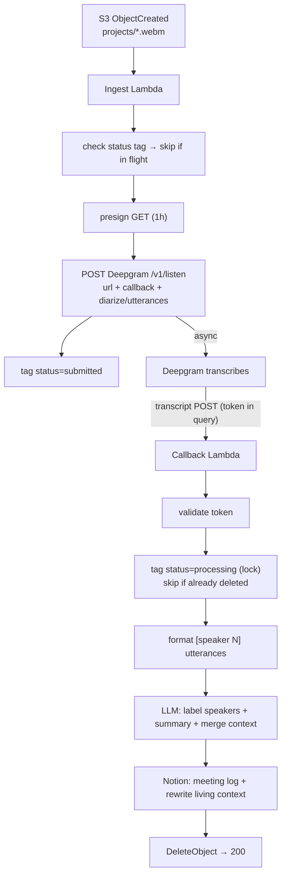

# filadd-chrome-recorder — Specification

## 1. Purpose

A Chrome extension plus processing pipeline that records Google Meet conversations and turns them into **transcriptions and derived artifacts** — the audio itself is transient. The design is:

- **Simpler for the user**: no screen-share picker, no pinned recording tab. The user starts recording from the extension popup; it stops automatically when they leave the call. An informative pill (above the join button pre-call, next to the avatar in the in-call top bar) shows what's happening and points to the extension icon.
- **Resilient**: the recording is streamed to S3 in parts *during* the call, so if anything crashes mid-call everything uploaded so far is recoverable.
- **Deterministic downstream**: each profile captures the association it needs (the **pitch id**) *at record time*, stamped as S3 object metadata, so the pipeline never has to reconstruct "which conversation is this?" after the fact.
- **Audio-transient by design**: S3 is a transient queue, not an archive. The pipeline deletes each object after successful processing; a lifecycle rule expires stragglers after 3 days. Only transcripts and what's derived from them persist.

## 2. Use cases / profiles

A **profile** describes what identifies a recording, where the audio stages, and what the pipeline does with it. Profiles are built into the extension; the user selects the active one in the popup. Fields are hardcoded per profile — there is no dynamic field framework.

| Profile | Purpose | Key template | Auto-resolved | User-provided | Pipeline destination |
|---|---|---|---|---|---|
| `project` | Pitch/project conversations | `projects/{timestamp}-{uuid}.webm` | meetSlug, timestamp, userId, uuid | `pitchId` (required — select over the settings-managed pitch list), `participants` (required — comma-separated names, prefilled from the previous recording of the same pitch) | Transcript + living context page under the Notion pitch |

`project` is the only profile that ships today. The machinery stays generic (the profile table is a const map, the type derives from it, the popup/settings loop over it) so another profile is a table entry, not a refactor.

### Object metadata is the pipeline contract

Keys are transient and don't encode browse structure (no per-session folders) — **`x-amz-meta-*` metadata carries everything the pipeline needs**:

| Metadata key | project | Source |
|---|---|---|
| `pitch_id` | ✓ | `pitchId` field (Notion page id) |
| `participants` | ✓ | `participants` field |
| `meet_slug` | ✓ | auto |
| `recorded_by` | ✓ | auto (`userId` setting) |
| `started_at` | ✓ | auto (`timestamp`) |

Constraints (AWS): metadata is set once at `CreateMultipartUpload` and is immutable afterwards; the total UTF-8 size of all keys+values is capped at 2 KB; values must stay US-ASCII or S3 RFC-2047-mangles them on read. The API therefore maps field names to these snake_case keys, strips non-ASCII, truncates each value to 256 chars, and enforces the 2 KB aggregate cap. Mutable per-object state (retry counts, failure markers) uses **object tags** instead — see §7.

**Trust boundary**: the extension sends raw values (`{profileId, auto, fields}`); the **API renders the object key and metadata** from its own copy of the profile table, sanitizing every key segment (allowlist `[a-zA-Z0-9_\-.]`, no `..`, no leading `/`) and validating field shapes (`pitchId` a 32-hex Notion page id). A tampered client cannot escape its prefix, choose a bucket, or smuggle metadata.

## 3. Architecture

```mermaid
flowchart LR
    CS["Content script<br/>pill + leave detection"] -->|"STOP"| SW["Service worker<br/>XState machine<br/>orchestration"]
    P["Popup<br/>profile + fields"] -->|"start / settings"| SW
    SW -->|"streamId + session"| OFF["Offscreen document<br/>capture + mix + record<br/>upload loop"]
    OFF -->|"PUT parts (presigned)"| S3["S3 (transient)"]
    OFF -->|"create / parts / complete / abort"| API["Upload API Lambda<br/>(Function URL, Hono)"]
    API --> S3
    S3 -->|"ObjectCreated projects/*.webm"| ING["Ingest Lambda<br/>presign GET + submit"]
    ING -->|"async + callback URL"| DG["Deepgram nova-3"]
    DG -->|"transcript POST"| CB["Callback Lambda<br/>format + LLM + Notion + delete"]
    CB --> NOTION["Notion (pitch)"]
    CB -->|"DeleteObject"| S3
```



### Context responsibilities

- **Service worker** (`src/background/service-worker.ts`): hosts the XState actor, handles invocation surfaces (action click, keyboard command), calls `tabCapture.getMediaStreamId`, manages the offscreen document lifecycle, watches `tabs.onRemoved`/`onUpdated` as the auto-stop backstop, and runs crash recovery on startup. Holds **no media handles** and does **no uploads**.
- **Offscreen document** (`src/offscreen/`): the only context allowed to hold MediaStreams long-term. Captures tab audio + mic, mixes, records, buffers, and uploads parts. Created with reason `USER_MEDIA` (no lifetime cap while active); explicitly closed after finalization.
- **Content script** (`src/content/`): detects Meet call pages, injects the Shadow-DOM overlay (toggle, recording indicator, coachmark), detects call end.
- **Popup** (`src/popup/`): profile picker, per-profile field form (pitch select + participants), userId setting, pitch-list management in settings, status mirror, recovery affordances.
- **Permission page** (`src/permission/`): a visible page whose only job is the one-time mic `getUserMedia` grant — offscreen documents cannot show permission prompts.

### State

- The recording lifecycle is an XState v5 machine: `idle → arming → recording → stopping → finalizing → finished`, plus `needsPermission` and `error`. The actor's persisted snapshot is written to `chrome.storage.session` on every transition and rehydrated when the SW restarts (MV3 SWs die after ~30 s idle — this is routine, not exceptional).
- A small **UI snapshot** (`{state, slug, profileId, startedAt, partsDone, error}`) is written to `chrome.storage.local`; the overlay and popup subscribe via `chrome.storage.onChanged`. No polling, and the UI keeps working while the SW sleeps.
- Non-serializable handles (streams, recorder, AudioContext) exist only in the offscreen document. If the SW rehydrates into `recording`, it pings the offscreen doc; no answer ⇒ transition to `error` and run upload recovery.

## 4. Research findings (drive the design — verified June 2026)

### 4.1 tabCapture invocation rules

`chrome.tabCapture.getMediaStreamId` requires **two distinct gates** ([docs](https://developer.chrome.com/docs/extensions/reference/api/tabCapture), [activeTab concept](https://developer.chrome.com/docs/extensions/develop/concepts/activeTab)):

1. **activeTab-style invocation on the target tab** — granted ONLY by: toolbar-icon click, `commands` keyboard shortcut, context-menu item, or omnibox. **Content-script clicks never grant it. Host permissions do not remove it. `chrome.action.openPopup()` does not count.** The grant persists while the user stays on the tab/origin.
2. **A transient user gesture** at call time — a content-script click *does* satisfy this; the call must happen synchronously in the gesture's message handler.

**Resulting UX**: recording starts from the popup — opening it (icon click or the `_execute_action` Ctrl+Shift+S shortcut) is the invocation, and the Start button click is the gesture, so `getMediaStreamId` always succeeds from there. The on-page pill is purely informative: while idle it points the user to the extension icon, then mirrors recording/uploading/finished/error. While a session is active the popup collapses to status + Stop.

### 4.2 Leave-call detection (locale-independent, layered)

Leave detection must be locale-independent and catch non-click exits (host ends the call, kicked, network drop), not just a localized "Leave call" button. It stops on the first of:

1. **Primary — DOM heartbeat**: Meet renders toolbar icons as Material ligatures whose *text content* (`call_end`) is locale-independent. The content script treats the presence of the `call_end` icon as an "in call" heartbeat; its debounced disappearance (~1.5 s, tolerating re-renders) means the call ended — by any path.
2. **Media-level**: the captured tab audio track fires `ended` when capture stops (tab closed/navigated) — observed in the offscreen document, fully DOM-independent.
3. **Backstop**: `tabs.onRemoved` / `onUpdated` (URL no longer a Meet slug) in the SW.
4. **Fast path**: a click listener on the `call_end` button stops instantly, ahead of the debounce.

There is no official API for this: the Meet Add-ons SDK is an embedded-iframe product, not an extension surface.

### 4.3 Audio pipeline

Canonical graph (verified against Chrome docs/samples):

```
tabSource ─ tabGain ──→ destNode (recording) ──→ MediaRecorder
tabSource ────────────→ ctx.destination (speakers — REQUIRED, capture mutes the tab)
micSource ─ micGain ──→ destNode (recording)     mic NEVER to speakers (feedback)
```

- Tab stream: `getUserMedia({ audio: { mandatory: { chromeMediaSource: "tab", chromeMediaSourceId } } })` — a streamId from the SW is consumable in the offscreen doc since Chrome 116.
- Mic: `echoCancellation: true` (Chrome default; cancels remote audio leaking into the mic; forces mono — fine for voice).
- `AudioContext` may start `suspended` in an offscreen doc → always `await ctx.resume()`.
- Recorder: `audio/webm;codecs=opus` (guarded by `isTypeSupported`), `audioBitsPerSecond: 64000` (~28 MB/h), ~3 s timeslice.
- **Meet's mute is mirrored, not inherited**: the extension's mic capture is an independent `getUserMedia` track — Meet mutes by disabling *its own* track, so muting in Meet doesn't naturally affect the recording (and capturing "the mic as sent to the tab" is impossible: tabCapture carries tab *playback* only, and no API taps another page's outbound WebRTC audio). The content script watches the mic button's locale-independent `data-is-muted` attribute and the offscreen doc ramps `micGain` to 0/1 accordingly; the initial state is queried when capture starts.
- Known limitation: live MediaRecorder webm lacks duration/cues metadata → the final object is valid and playable but not seekable until remuxed (`ffmpeg -c copy`). Irrelevant once the pipeline consumes and deletes the audio.

### 4.4 Streaming multipart upload

Verified against AWS docs ([limits](https://docs.aws.amazon.com/AmazonS3/latest/userguide/qfacts.html), [overview](https://docs.aws.amazon.com/AmazonS3/latest/userguide/mpuoverview.html)):

- `CompleteMultipartUpload` is **pure byte concatenation** in part-number order. Splitting the MediaRecorder webm byte stream at arbitrary boundaries is valid; parts need not be independently playable; the final object is byte-identical to the original stream.
- Parts: 5 MiB–5 GiB each (last part any size), max 10,000. **Part numbers must be consecutive from 1** — a hard failure with SDK checksums active, and AWS SDK v3 enables CRC checksums by default. The API's S3Client therefore sets `requestChecksumCalculation: "WHEN_REQUIRED"` to keep presigned part PUTs signature-clean.
- Multipart sessions never expire and incomplete uploads bill storage → the bucket needs a lifecycle rule `AbortIncompleteMultipartUpload: { DaysAfterInitiation: 7 }`.
- **Bucket CORS must list `ETag` in `ExposeHeaders`** or `response.headers.get("ETag")` silently returns `null` (the classic browser-multipart failure). See §8.
- `ListParts` can rebuild `{PartNumber, ETag}` after a crash, but AWS recommends maintaining your own ETag ledger and using ListParts only for verification — we do both.
- Uploads run in the **offscreen document**: MV3 service workers are killed on >30 s fetches / >5 min requests; a `USER_MEDIA` offscreen doc has no such caps.
- **Object metadata must be supplied at `CreateMultipartUpload`** — not on parts, not on complete — and is immutable afterwards (changing it requires a self-copy). User-defined metadata is capped at 2 KB total and is returned by `HeadObject`/`GetObject` but **not** by `ListObjectsV2` — fine: the pipeline reads the contract with a `HeadObject` on the event's key (§7).

### 4.5 Persistence: metadata only, no audio in IndexedDB

The offscreen document owns capture; if it dies, capture is over — there is no future audio to protect. Persisting audio bytes to IndexedDB would only salvage the *unflushed tail* (< one part) after a full browser crash, at the cost of doubling I/O for the entire recording.

**Decision**: audio buffers in memory; `{uploadId, key, bucketRef, profileId, parts: {partNumber → ETag}}` persists to `chrome.storage.local` after every successful part. Worst-case loss on a hard crash = the unflushed tail — parts can only be cut at the 5 MiB floor (S3 rejects smaller non-final parts, so a time-based flush is impossible), which at 64 kbps means up to ~11 minutes of audio. Recovery on restart completes the uploaded prefix into a playable object. Revisit only if "never lose the last minutes across a browser crash" becomes a product requirement.

### 4.6 State machine library

XState v5: the only mature option with first-class snapshot persistence (`actor.getPersistedSnapshot()` / `createActor(machine, { snapshot })`), DOM-free core, TypeScript-first. `@xstate/fsm` is deprecated; robot3/zag-js have no persistence story. Caveats handled: actions are not re-executed on rehydrate; snapshots are invalidated by machine-shape changes → fall back to `idle` on an unreadable snapshot.

## 5. Recording flow (end to end)

1. Content script matches `meet.google.com/([a-z]{3}-[a-z]{4}-[a-z]{3})` → injects the informative pill: above the join button on the pre-join screen (`[data-promo-anchor-id="join-button"]` → `[jsname="Qx7uuf"]`), after the account avatar in the in-call top bar (geometric heuristic over `img[src*="googleusercontent.com"]`), floating top-right as fallback. While idle the pill points to the extension icon.
2. User starts from the popup (or Ctrl+Shift+S). Mic missing → SW opens the permission page; required fields unfilled (project: pitch + participants) → the popup form blocks the start.
3. SW: `getMediaStreamId({ targetTabId })` → creates the upload session via the API (which stamps the metadata at `CreateMultipartUpload`) and persists the session ledger → ensures the offscreen doc → sends `START_CAPTURE { streamId, session }`.
4. Offscreen: builds the audio graph, starts MediaRecorder; chunks accumulate in memory; at ≥5 MiB a part is cut → presigned URL requested → PUT (retry w/ exponential backoff + jitter; fresh URL per attempt) → `{partNumber, etag}` reported to the SW, which persists the ledger (offscreen docs cannot touch `chrome.storage` — they only get `chrome.runtime`).
5. Stop (leave detection, tab close, track end, or popup stop button) → streams released immediately (the OS recording indicator goes away) → final part of any size flushed → `complete` → UI snapshot `finished` → offscreen doc closed.
6. Cancel → `abort` (no orphaned parts billing).
7. `runtime.onStartup`: an unfinished persisted session → verify via ListParts → complete the prefix, or surface retry/abort in the popup.

## 6. Upload API

The extension never holds AWS credentials, so multipart orchestration (create, presign part URLs, complete, abort, recover) is server-side. The endpoint **contract** below is fixed — it is what `src/upload/api-client.ts` calls — and is implementation-agnostic; bearer auth + an origin allowlist gate every route.

### 6.1 Contract (what the offscreen client calls)

All requests carry `Authorization: Bearer <token>` and `Content-Type: application/json`; CORS exposes `Authorization`/`Content-Type` to the extension origin (§8).

| Route | Body → Response |
|---|---|
| `POST /uploads` | `{profileId, auto, fields}` → validates (required fields, `pitchId` 32-hex), renders + sanitizes key, builds snake_case metadata, `CreateMultipartUpload` → `{uploadId, key, bucketRef}` |
| `POST /uploads/parts` | `{bucketRef, key, uploadId, partNumbers[]}` → `{urls: [{partNumber, url}]}` (presigned `UploadPart`, 1 h). Client requests one part at a time today; the array shape allows batching. |
| `POST /uploads/complete` | `{bucketRef, key, uploadId, parts: [{PartNumber, ETag}]}` → `{key, location}` (parts sorted by `PartNumber` before `CompleteMultipartUpload`) |
| `POST /uploads/list-parts` | `{bucketRef, key, uploadId}` → `{parts: [{PartNumber, ETag}]}` (paginated; recovery) |
| `DELETE /uploads` | `{bucketRef, key, uploadId}` → `{aborted: true}` |

`bucketRef` is the logical profile bucket (`project`), resolved server-side to a real bucket — never a raw bucket name from the client.

### 6.2 Production host: AWS Lambda

The contract is served by a **credentialed signer** — the single component that holds AWS access. The extension never holds credentials: it PUTs each part **directly to S3** with a presigned URL (the high-volume path), and calls the signer only to create the upload, mint part URLs on demand, and finalize.

- The signer owns the **trust boundary**: it validates fields, renders + sanitizes the key, and sets the immutable object metadata at `CreateMultipartUpload` (§2). The client only ever names a logical `bucketRef`.
- `POST /uploads` and `POST /uploads/parts` must be server-side (validation + metadata; repeated on-demand signing). `complete` / `abort` / `list-parts` stay on the signer too, so S3's XML never leaks into the extension.

It runs as a single **AWS Lambda behind a Function URL**, sitting next to the bucket it signs for:

- `api/` (Node + Hono + AWS SDK v3) is the deployable, not just a reference: `app.ts` holds the routes, `index.ts` serves it locally via `@hono/node-server`, and `lambda.ts` wraps it for Lambda via Hono's built-in `hono/aws-lambda` adapter. `keys.ts` / `profiles.ts` stay the trust-boundary validation and the contract's source of truth.
- Provisioned with **AWS SAM** (`api/template.yaml`, esbuild build): the signer Lambda, the §7 pipeline Lambdas, their roles and Function URLs, and the bucket itself. The bucket (§8) is created and owned by the stack and pinned with `DeletionPolicy: Retain`, so a `sam delete` never drops it or its objects.
- **No stored credentials**: the Lambda's **IAM execution role** grants only the multipart actions (`CreateMultipartUpload`, `UploadPart`, `CompleteMultipartUpload`, `AbortMultipartUpload`, `ListParts`) on the bucket. The S3Client picks up role credentials automatically — no access keys anywhere.
- **CORS + TLS** come from the Function URL: `AllowOrigins` = the extension origin (§8). Function URL auth is `NONE`; the app does its own timing-safe **bearer-token** check (fail-closed).
- Presigned part URLs are signed with the role's temporary credentials (≈1 h) — fine, since the client requests a fresh URL per part per attempt; `complete` / `abort` / `list-parts` are plain server-side S3 calls, so their lifetime is never bounded by URL expiry.

The §7 processing pipeline runs in the **same SAM stack** as a pair of event-driven Lambdas — no separate host.

Env (local dev — `api/.env.example`): `API_TOKEN`, `ALLOWED_ORIGINS`, `AWS_REGION`, AWS credentials, `S3_BUCKET_PROJECT` (the transient bucket), `PRESIGN_EXPIRES_SECONDS`. In production the AWS credentials come from the Lambda execution role, not env; the pipeline Lambdas' secrets come from Secrets Manager (§7).

## 7. Processing pipeline (event-driven AWS)

The bucket is the only state: an object's existence means "pending", its deletion means "done" — no ledger database. The pipeline is two Lambdas in the §6 SAM stack, triggered by S3 events and driven by Deepgram **async callbacks**.



**Mechanics**

- **Trigger**: a native S3 `ObjectCreated:*` notification (prefix `projects/`, suffix `.webm`) invokes the **Ingest Lambda** (`api/src/ingest.ts`) — one event per `CompleteMultipartUpload`, no poll latency. The bucket is in the stack (§8), so SAM owns the notification config.
- **Ingest**: presigns a GET URL for the object and POSTs it to Deepgram (`nova-3`, `language=multi&diarize=true&punctuate=true&utterances=true`, `callback=<CallbackFn URL>?key=&token=`). Deepgram fetches the audio itself and acks immediately with a `request_id`, so the Lambda returns in milliseconds. The object is tagged `status=submitted`. Idempotent: a duplicate event (S3 is at-least-once) is skipped when a `status` tag already exists. Async-invoke failures land in an SQS DLQ.
- **Callback** (`api/src/callback.ts`, its own Function URL): Deepgram POSTs the transcript when done. It validates the shared-secret `token` (timing-safe; the `dg-token` header is available as defense-in-depth), tags `status=processing`, `HeadObject`s the metadata contract (§2), formats the utterances as `[speaker N] text` lines, routes (below), then `DeleteObject` and returns 200.
- **Idempotency / retry**: delete-on-success is the terminus — a duplicate callback for an already-deleted key gets `NoSuchKey` on `HeadObject` and acks 200 without re-writing. On failure the callback returns 5xx and Deepgram re-POSTs (up to ~10×, 30 s apart). That is the lean retry budget; an outage longer than that drops the recording before the 3-day lifecycle expiry (§8) — acceptable for now, revisit with SQS decoupling if it bites. The biggest risk is the inline LLM+Notion work exceeding Deepgram's callback HTTP timeout, which would make Deepgram retry while attempt #1 is still running; the `status=processing` tag and an idempotent Notion upsert (keyed by `pitch_id`) bound the damage.
- **Secrets**: the Deepgram key, callback token, LLM key, and Notion key live in a single **Secrets Manager** secret (`PIPELINE_SECRET_ARN`), fetched once per cold start and memoized — never in a Lambda env var. The LLM is provider-agnostic (`LLM_BASE_URL` / `LLM_MODEL`, OpenAI-compatible).
- Routing is derived from the profile table (`api/src/pipeline/routing.ts` maps a key prefix back to a profile), so re-adding a profile is a table entry — only `project` is wired today.

**Project branch** (`api/src/pipeline/notion.ts`)

1. One LLM pass over the `[speaker N]` transcript + the `participants` metadata + the pitch's current living context, returning JSON `{labeledTranscript, summary, context}`: it relabels speakers with participant names using conversational cues (a low-confidence speaker keeps its generic label), writes a bullet summary, and merges the conversation into the running context (topics, decisions, open action items).
2. In Notion, anchored on the `pitch_id` page:
   - Ensure a **`🎙 Meeting log`** child page; append a dated entry (`date · participants`, summary, full labeled transcript in a toggle).
   - Maintain a **`🧭 Current context`** child page, rewritten each run with the merged context — renaming a still-generic speaker by editing Notion *is* the labeling interface.

(The Pitches DB lives at data source `collection://66dec714-8dee-48df-bab4-332514bc087f`; the pipeline anchors on the `pitch_id` page directly. Notion block shapes in `notion.ts` should be verified against the live workspace before the first production run.)

## 8. S3 bucket setup (transient, stack-managed)

The bucket lives in **`sa-east-1`** and the **whole stack deploys there** — a native S3→Lambda notification only fires when the function shares the bucket's region (and signing/control-plane calls stay in-region).

The bucket (`RecordingsBucket`, name `filadd-chrome-recorder`) is **created and owned by the SAM stack** — a plain `sam deploy` provisions it. The name must be globally free for the create to succeed. `DeletionPolicy: Retain` keeps a stack delete from dropping it (or failing on a non-empty bucket). The extension ID is pinned via the `key` field in `manifest.config.ts` (public half of the gitignored `extension-key.pem`), so the `chrome-extension://` origin is stable across reinstalls and CORS can name it exactly (`ExtensionOrigin` parameter).

CORS, lifecycle, and the S3→Ingest notification now live in the template's bucket resource:

- **CORS**: `AllowedOrigins: [<extension origin>]`, `AllowedMethods: [PUT]`, `AllowedHeaders: ["*"]`, `ExposedHeaders: [ETag]` — the `ETag` exposure is mandatory for browser multipart (§4.4).
- **Lifecycle**: `AbortIncompleteMultipartUpload` after 7 days, and object expiration after 3 days — the terminal backstop that makes "we never retain audio" a property of the system, not a promise of the pipeline.
- **Notification**: SAM wires `ObjectCreated:*` (prefix `projects/`, suffix `.webm`) to the Ingest Lambda — don't hand-write `NotificationConfiguration`, SAM owns it.

## 9. Future work (explicitly out of scope for v1)

- SQS-decoupled callback (Deepgram → ack-fast → queue → router) if the lean inline retry budget (§7) proves too tight.
- Remote/dynamic profiles fetched from the API.
- Tail persistence across browser crashes (IndexedDB) if it becomes a product requirement.
- Mic device picker.
